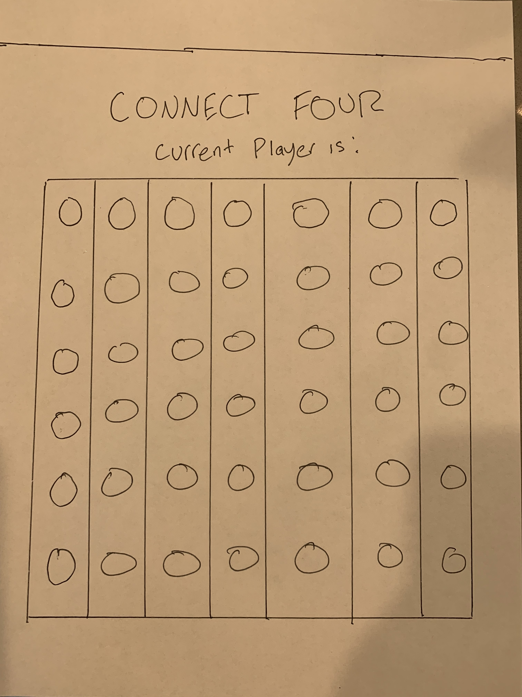

README.md

<title>CONNECT FOUR</title>

Technologies
-Javascript
-HTML
-CSS

wire frame skecth 

PSEUDOCODE

-HTML
* Connect four as title at top of screen
* the current player displayed directly under
* A 6 by 7 connect four board with no holes

-CSS
*transparent board
*the chips the player drops into the board should be yellow and Red 
*green background emulating chalkboard 
*connect four and current player should display as white (chalk)

-JAVASCRIPT
* function changePlayerTurn(){
    - check who is current player
    - switch from player 1 to player 2
    - run function for next action in game
  }

* function checkForWinner(){
    -check if a row of four has been completed horizontally
    -check if row of four has been completed vertically
    -check if row of four has been completed diagonally
    -list out winning arrays
    -give winning message when row of four has been completed

}

* function dropChip(){
    -check when each player has dropped there chip into the game board
    -see where that chip is in relation to the other chips on the board
    -don't let a chip go in an innapropriate area of the board
    -give alert message if chip is placed incorrectly on board
}

//link
https://cristiaanh.github.io/connect-four/

//screenshot

//instructions
-click on a circle in the board with the intention of getting your color (either red, or yellow) four in a row. You can acheive four in a row diagonally, vertically, or horizontally. Once you get four in a row, you win.

//future plans
-add  better background and play around with font
-add animation of chips falling into the board
-make chips transparent
-give the game a theme..halloween, christmas etc.